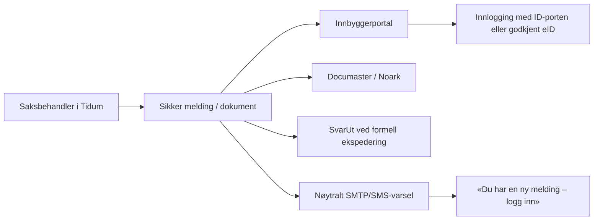

Vi løser dette med kanalseparasjon, ikke ved å «herde SMTP litt mer»:
- SMTP/SMS brukes bare til innholdsløse varsler.
- Løpende kommunikasjon skjer i en innlogget innbyggerportal.
- Formelle brev og vedtak ekspederes gjennom KS Fiks SvarUt.
- Alle meldinger, dokumenter og kvitteringer journalføres og arkiveres.

Kanalreglene
Innhold	Kanal
Saksopplysninger, navn, vurderinger, journalnotater	Portal
Dokumenter, rapporter og vedtak	Portal eller SvarUt
Formell ekspedering og mottakskvittering	SvarUt/SvarInn
«Du har en ny melding»	SMTP/SMS
Saksnummer, barnets navn, dokumenttittel eller vedlegg	Aldri SMTP/SMS

Eksempel på tillatt e-post:
Emne: Ny melding fra Halden kommune
Du har mottatt en ny melding. Logg inn på Halden kommunes innbyggerportal for å lese den.

Ingen saks-ID, barnets navn, direkte dokumentlenke eller påloggingstoken skal være med.
Datatilsynet sier at sensitive personopplysninger normalt må krypteres ved overføring og oppbevares kryptert frem til de er tatt inn i egnet system. TLS på SMTP gir ikke tilstrekkelig kontroll over mottakers postkasse, videresending, tilgang, tilbakekalling og journalføring. Datatilsynet om sensitiv e-post
Hva Tidum allerede kan gjenbruke
Vi har et godt teknisk utgangspunkt:
- Direkte BankID og Buypass finnes i [eid-auth.ts](/Users/danielqazi/tidsflyt/server/eid-auth.ts), inkludert fødselsnummer-hashing og innloggingslogg.
- Arkivering har allerede idempotent outbox, retry og Noark/Documaster-adapter i [archive-service.ts](/Users/danielqazi/tidsflyt/server/lib/archive/archive-service.ts).
- Journal og private journalvedlegg finnes i [062_sak_journal.sql](/Users/danielqazi/tidsflyt/migrations/062_sak_journal.sql).
- Maskinporten-tokenklienten for KS Fiks finnes i [maskinporten-client.ts](/Users/danielqazi/tidsflyt/server/fiks-io/maskinporten-client.ts).
- Den herdede e-postkomponisten kan brukes til nøytrale varsler, men [progress.md (line 194)](/Users/danielqazi/tidsflyt/progress.md:194) dokumenterer riktig at den ikke er en sikker barnevernskanal.
Det som mangler, er selve parts- og dialogmodellen. Nåværende BankID/Buypass-løsning kobler eID til eksisterende systembrukere. Den er ikke automatisk en innbyggerportal for foreldre, barn, verger eller fullmektiger.
Implementeringsrekkefølge
1. Steng farlig SMTP-bruk først
   - For kommuner/barnevernsmodulen skal generisk e-post med fritekst, saksrapport eller vedlegg være sperret server-side.
   - Kun hardkodede, nøytrale varselmaler tillates.
   - Samme regel må dekke umiddelbar sending, utkast og planlagt sending.
   - Ingen automatisk fallback til SMTP dersom portal eller SvarUt er nede.
   - Blokkerte forsøk logges i audit.
   - Brukervalg som «denne e-posten er ikke sensitiv» er ikke tilstrekkelig kontroll.
2. Bygg parts- og tilgangsmodellen
   Nye tabeller bør minst dekke:
   - personer/parter med stabil eID-identitet;
   - tilknytning til konkret sak;
   - rolle: forelder, barn, verge eller fullmektig;
   - gyldighetsperiode, grunnlag og tilbakekalling;
   - hvilke dokumenter og samtaler parten faktisk kan se.
   Tilgang skal aldri utledes fra e-postadresse. Alle oppslag må være kommune-, saks- og partsskopet.
3. Bygg sikker dialog
   - Immutable sendte meldinger; utkast kan redigeres.
   - Private vedlegg i objektlagring med KMS-kryptering.
   - Filtypekontroll, signaturkontroll, antivirus og sjekksum.
   - Ingen offentlige fil-URL-er.
   - Audit for listevisning, åpning, lesing, nedlasting, sending, deling og tilbakekalling.
   - Meldinger og dokumenter journalføres gjennom eksisterende arkiv-outbox.
4. Etabler innbyggerinnlogging
   Foretrukket løsning er Halden-eid eller Halden-autorisert ID-porten-integrasjon, mens Tidum er teknisk leverandør. Digdir åpner for at leverandører integrerer på vegne av offentlige kunder, men en privat leverandør kan ikke uten videre eie bruken selv. Digdir om private leverandører
   ID-porten-klienten må validere blant annet issuer, audience, signatur, state, nonce, PKCE og tilstrekkelig acr. For sensitive tjenester brukes nivå høyt. ID-porten om token og sikkerhetsnivå
   Direkte BankID/Buypass kan teknisk gjenbrukes, men bare dersom Halden skriftlig aksepterer dette som alternativ til ID-porten.
5. Implementer SvarUt/SvarInn
   SvarUt brukes til vedtak, formelle brev og mottakere som ikke bruker dialogportalen. Vi gjenbruker Maskinporten-klienten, men må bygge:
   - forsendelses-outbox med idempotensnøkkel;
   - dokumentoverføring;
   - status og kvitteringer;
   - retry/dead-letter;
   - arkivering av forsendelse og kvittering;
   - SvarInn for retur og innkommende dokumenter.
   KS beskriver SvarUt som distribusjonskanal mot blant annet digital postkasse, Altinn og fysisk post. KS Fiks SvarUt og REST-grensesnittet.
Ansvarsdelingen
Halden må:
- eie eller autorisere ID-porten- og Fiks-integrasjonene;
- bestemme hvem som er part/fullmektig og hva de får innsyn i;
- godkjenne kanalregler, DPIA, lagring, retensjon og arkivrutiner;
- stille testmiljø og nødvendige integrasjonsfullmakter til rådighet.
Tidum må:
- implementere portal, integrasjoner og saksavgrenset autorisasjon;
- sørge for kryptering, nøkkelhåndtering, audit og sikker lagring;
- sikre at ingen sensitiv SMTP-fallback finnes;
- levere integrasjons-, BOLA-, feilmodus- og ende-til-ende-tester;
- dokumentere drift, hendelseshåndtering og databehandleransvar.
Når kravet kan regnes som ferdig
Kravet er ikke lukket før følgende er bevist:
- sensitiv SMTP blir teknisk avvist;
- en part kan bare lese eksplisitt delte objekter i egne saker;
- tilbakekalt tilgang virker umiddelbart;
- varsler inneholder ingen saksopplysninger;
- SvarUt gir sporbar kvittering uten duplikatforsendelser;
- meldinger, dokumenter og kvitteringer arkiveres;
- systemet feiler lukket ved bortfall av ID-porten, lagring, arkiv eller Fiks;
- flyten er testet i reelle testmiljøer og sikkerhetsgjennomgått.
Det riktige neste kodearbeidet er derfor en avgrenset «SMTP policy gate»-pakke, fulgt av migrasjon og API-grunnmur for partsmodell og sikker dialog. Arkitekturplanen er bevisst lagt som en minimal utvidelse av det vi allerede har, særlig eID, journal, arkiv-outbox og Maskinporten.